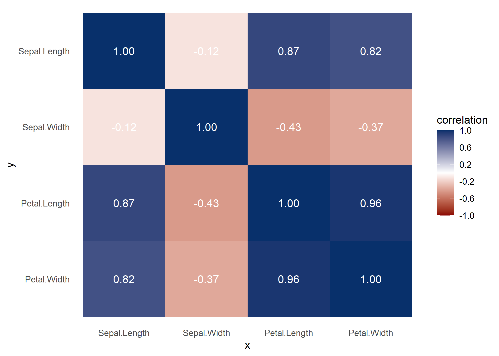
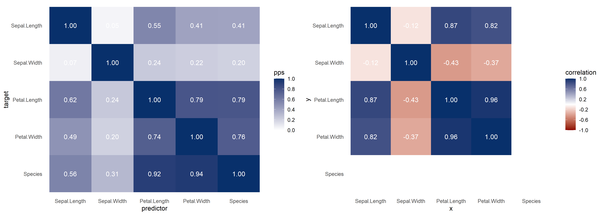
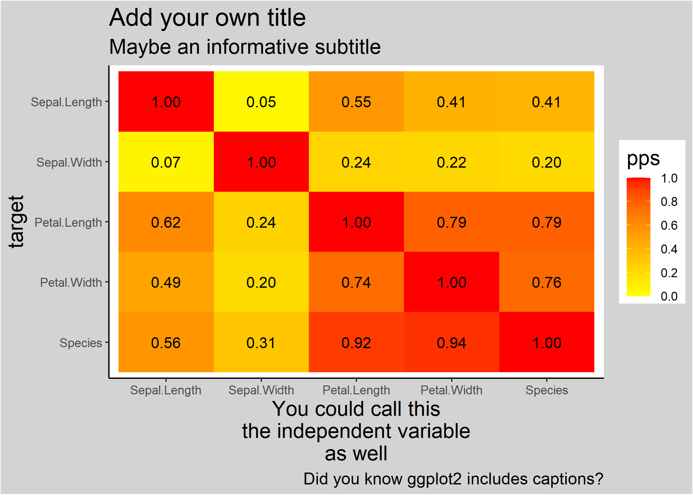

<!-- README.md is generated from README.Rmd. Please edit that file -->

# `ppsr` - Predictive Power Score

<!-- badges: start -->

[](https://github.com/paulvanderlaken/ppsr/actions)
<!-- badges: end -->

`ppsr` is the R implementation of the **Predictive Power Score** (PPS).

The PPS is an asymmetric, data-type-agnostic score that can detect
linear or non-linear relationships between two variables. The score
ranges from 0 (no predictive power) to 1 (perfect predictive power).

The general concept of PPS is useful for data exploration purposes, in
the same way correlation analysis is. You can read more about the
(dis)advantages of using PPS in [this blog
post](https://towardsdatascience.com/rip-correlation-introducing-the-predictive-power-score-3d90808b9598).

## Installation

You can install the development version of `ppsr` using the following R
code:

``` r
# You can get the development version from GitHub:
# install.packages('devtools')
devtools::install_github('https://github.com/paulvanderlaken/ppsr')
```

## Computing PPS

**PPS** represents a **framework for evaluating predictive validity**.

There is *not one single way* of computing a predictive power score, but
rather there are *many different ways*.

You can select different machine learning algorithms, their associated
parameters, cross-validation schemes, and/or model evaluation metrics.
Each of these design decisions will affect your model’s predictive
performance and, in turn, affect the resulting predictive power score
you compute.

Hence, you can compute many different PPS for any given predictor and
target variable.

For example, the PPS computed with a *decision tree* regression model…

``` r
ppsr::score(iris, x = 'Sepal.Length', y = 'Petal.Length', algorithm = 'tree')[['pps']]
#> [1] 0.6160836
```

…will differ from the PPS computed with a *simple linear regression*
model.

``` r
ppsr::score(iris, x = 'Sepal.Length', y = 'Petal.Length', algorithm = 'glm')[['pps']]
#> [1] 0.5441131
```

## Usage

The `ppsr` package has four main functions to compute PPS:

  - `score()` computes an x-y PPS
  - `score_predictors()` computes all X-y PPS
  - `score_df()` computes all X-Y PPS
  - `score_matrix()` computes all X-Y PPS, and shows them in a matrix

where `x` and `y` represent an individual predictor/target, and `X` and
`Y` represent all predictors/targets in a given dataset.

Examples:

``` r
ppsr::score(iris, x = 'Sepal.Length', y = 'Petal.Length')
#> $x
#> [1] "Sepal.Length"
#> 
#> $y
#> [1] "Petal.Length"
#> 
#> $result_type
#> [1] "predictive power score"
#> 
#> $pps
#> [1] 0.6160836
#> 
#> $metric
#> [1] "MAE"
#> 
#> $baseline_score
#> [1] 1.571967
#> 
#> $model_score
#> [1] 0.5971445
#> 
#> $cv_folds
#> [1] 5
#> 
#> $seed
#> [1] 1
#> 
#> $algorithm
#> [1] "tree"
#> 
#> $model_type
#> [1] "regression"
```

``` r
ppsr::score_predictors(df = iris, y = 'Species')
#>              x       y                       result_type       pps      metric
#> 1 Sepal.Length Species            predictive power score 0.5591864 F1_weighted
#> 2  Sepal.Width Species            predictive power score 0.3134401 F1_weighted
#> 3 Petal.Length Species            predictive power score 0.9167580 F1_weighted
#> 4  Petal.Width Species            predictive power score 0.9398532 F1_weighted
#> 5      Species Species predictor and target are the same 1.0000000        <NA>
#>   baseline_score model_score cv_folds seed algorithm     model_type
#> 1      0.3176487   0.7028029        5    1      tree classification
#> 2      0.3176487   0.5377587        5    1      tree classification
#> 3      0.3176487   0.9404972        5    1      tree classification
#> 4      0.3176487   0.9599148        5    1      tree classification
#> 5             NA          NA       NA   NA      <NA>           <NA>
```

``` r
ppsr::score_df(df = iris)
#>               x            y                       result_type        pps
#> 1  Sepal.Length Sepal.Length predictor and target are the same 1.00000000
#> 2   Sepal.Width Sepal.Length            predictive power score 0.04632352
#> 3  Petal.Length Sepal.Length            predictive power score 0.54913985
#> 4   Petal.Width Sepal.Length            predictive power score 0.41276679
#> 5       Species Sepal.Length            predictive power score 0.40754872
#> 6  Sepal.Length  Sepal.Width            predictive power score 0.06790301
#> 7   Sepal.Width  Sepal.Width predictor and target are the same 1.00000000
#> 8  Petal.Length  Sepal.Width            predictive power score 0.23769911
#> 9   Petal.Width  Sepal.Width            predictive power score 0.21746588
#> 10      Species  Sepal.Width            predictive power score 0.20128762
#> 11 Sepal.Length Petal.Length            predictive power score 0.61608360
#> 12  Sepal.Width Petal.Length            predictive power score 0.24263851
#> 13 Petal.Length Petal.Length predictor and target are the same 1.00000000
#> 14  Petal.Width Petal.Length            predictive power score 0.79175121
#> 15      Species Petal.Length            predictive power score 0.79049070
#> 16 Sepal.Length  Petal.Width            predictive power score 0.48735314
#> 17  Sepal.Width  Petal.Width            predictive power score 0.20124105
#> 18 Petal.Length  Petal.Width            predictive power score 0.74378445
#> 19  Petal.Width  Petal.Width predictor and target are the same 1.00000000
#> 20      Species  Petal.Width            predictive power score 0.75611126
#> 21 Sepal.Length      Species            predictive power score 0.55918638
#> 22  Sepal.Width      Species            predictive power score 0.31344008
#> 23 Petal.Length      Species            predictive power score 0.91675800
#> 24  Petal.Width      Species            predictive power score 0.93985320
#> 25      Species      Species predictor and target are the same 1.00000000
#>         metric baseline_score model_score cv_folds seed algorithm
#> 1         <NA>             NA          NA       NA   NA      <NA>
#> 2          MAE      0.6893222   0.6620058        5    1      tree
#> 3          MAE      0.6893222   0.3100867        5    1      tree
#> 4          MAE      0.6893222   0.4040123        5    1      tree
#> 5          MAE      0.6893222   0.4076661        5    1      tree
#> 6          MAE      0.3372222   0.3184796        5    1      tree
#> 7         <NA>             NA          NA       NA   NA      <NA>
#> 8          MAE      0.3372222   0.2564258        5    1      tree
#> 9          MAE      0.3372222   0.2631636        5    1      tree
#> 10         MAE      0.3372222   0.2677963        5    1      tree
#> 11         MAE      1.5719667   0.5971445        5    1      tree
#> 12         MAE      1.5719667   1.1945031        5    1      tree
#> 13        <NA>             NA          NA       NA   NA      <NA>
#> 14         MAE      1.5719667   0.3265152        5    1      tree
#> 15         MAE      1.5719667   0.3280552        5    1      tree
#> 16         MAE      0.6623556   0.3377682        5    1      tree
#> 17         MAE      0.6623556   0.5315834        5    1      tree
#> 18         MAE      0.6623556   0.1684906        5    1      tree
#> 19        <NA>             NA          NA       NA   NA      <NA>
#> 20         MAE      0.6623556   0.1608119        5    1      tree
#> 21 F1_weighted      0.3176487   0.7028029        5    1      tree
#> 22 F1_weighted      0.3176487   0.5377587        5    1      tree
#> 23 F1_weighted      0.3176487   0.9404972        5    1      tree
#> 24 F1_weighted      0.3176487   0.9599148        5    1      tree
#> 25        <NA>             NA          NA       NA   NA      <NA>
#>        model_type
#> 1            <NA>
#> 2      regression
#> 3      regression
#> 4      regression
#> 5      regression
#> 6      regression
#> 7            <NA>
#> 8      regression
#> 9      regression
#> 10     regression
#> 11     regression
#> 12     regression
#> 13           <NA>
#> 14     regression
#> 15     regression
#> 16     regression
#> 17     regression
#> 18     regression
#> 19           <NA>
#> 20     regression
#> 21 classification
#> 22 classification
#> 23 classification
#> 24 classification
#> 25           <NA>
```

``` r
ppsr::score_matrix(df = iris)
#>              Sepal.Length Sepal.Width Petal.Length Petal.Width   Species
#> Sepal.Length   1.00000000  0.04632352    0.5491398   0.4127668 0.4075487
#> Sepal.Width    0.06790301  1.00000000    0.2376991   0.2174659 0.2012876
#> Petal.Length   0.61608360  0.24263851    1.0000000   0.7917512 0.7904907
#> Petal.Width    0.48735314  0.20124105    0.7437845   1.0000000 0.7561113
#> Species        0.55918638  0.31344008    0.9167580   0.9398532 1.0000000
```

Currently, the `ppsr` package computes PPS by default using…

  - the default decision tree implementation of the `rpart` package,
    wrapped by `parsnip`
  - *weighted F1* scores to evaluate classification models, and *MAE* to
    evaluate regression models
  - 5 cross-validations

You can call the `available_algorithms()` and
`available_evaluation_metrics()` functions to see what alternative
settings are supported.

Note that the calculated PPS reflects the **out-of-sample** predictive
validity when more than a single cross-validation is used.

## Visualizing PPS

Subsequently, there are three main functions that wrap around these
computational functions to help you visualize your PPS using `ggplot2`:

  - `visualize_pps()` produces a barplot of all X-y PPS, or a heatmap of
    all X-Y PPS
  - `visualize_correlations()` produces a heatmap of all X-Y
    correlations
  - `visualize_both()` produces the two heatmaps of all X-Y PPS and
    correlations side-by-side

Examples:

``` r
# If you specify the target variable (y), you get a barplot of its predictors
ppsr::visualize_pps(df = iris, y = 'Species')
```

<!-- -->

``` r
# If you do **not** specify the target variable (y), you get a PPS matrix visualized as a heatmap 
ppsr::visualize_pps(df = iris)
```

<!-- -->

``` r
ppsr::visualize_correlations(df = iris)
```

<!-- -->

``` r
ppsr::visualize_both(df = iris)
```

<!-- -->

You can change the colors of the visualizations using the functions
arguments. There are also arguments to change the color of the text
scores.

Furthermore, the functions return `ggplot2` objects, so that you can
easily change the theme and other settings.

``` r
ppsr::visualize_pps(df = iris,
                    color_value_high = 'red', 
                    color_value_low = 'yellow',
                    color_text = 'black') +
  ggplot2::theme_classic() +
  ggplot2::theme(plot.background = ggplot2::element_rect(fill = "lightgrey")) +
  ggplot2::theme(title = ggplot2::element_text(size = 15)) +
  ggplot2::labs(title = 'Add your own title', 
                subtitle = 'Maybe an informative subtitle',
                caption = 'And a nice caption',
                x = 'You could call this\nthe independent variable\nas well')
```

<!-- -->

## Parallelization

The number of predictive models that one needs to build in order to fill
the PPS matrix belonging to a dataframe increases exponentially with
every new column in that dataframe.

For traditional correlation analyses, this is not a problem. Yet, with
more computation-intensive algorithms, with many train-test splits, and
with large or high-dimensional datasets, it can take a decent amount of
time to build all the predictive models and derive their PPSs.

One way to speed matters up is to use the `ppsr::score_predictors()`
function and focus on predicting only the target/dependent variable you
are most interested in.

Yet, since version `0.0.1`, all `ppsr::score_*` and `pssr::visualize_*`
functions now take in two arguments that facilitate parallel computing.
You can parallelize `ppsr`’s computations by setting the `do_parallel`
argument to `TRUE`. If done so, a cluster will be created using the
`parallel` package. By default, this cluster will use the maximum number
of cores (see `parallel::detectCores()`) minus 1.

However, with the second argument – `n_cores` – you can manually specify
the number of cores you want `ppsr` to use.

Examples:

``` r
ppsr::score_df(df = mtcars, do_parallel = TRUE)
```

``` r
ppsr::visualize_pps(df = iris, do_parallel = TRUE, n_cores = 2)
```

## Interpreting PPS

The PPS is a **normalized score** that ranges from 0 (no predictive
power) to 1 (perfect predictive power).

The normalization occurs by comparing how well we are able to predict
the values of a *target* variable (`y`) using the values of a
*predictor* variable (`x`), respective to two **benchmarks**: a perfect
prediction, and a naive prediction

The **perfect prediction** can be theoretically derived. A perfect
regression model produces no error (=0.0), whereas a perfect
classification model results in 100% accuracy, recall, et cetera (=1.0).

The **naive prediction** is derived empirically. A naive regression
model is simulated by predicting the mean `y` value for all
observations. This is similar to how R-squared is calculated. A naive
classification model is simulated by taking the best among two models:
one predicting the modal `y` class, and one predicting random `y`
classes for all observations.

Whenever we train an “informed” model to predict `y` using `x`, we can
assess how well it performs by comparing it to these two benchmarks.

Suppose we train a regression model, and its mean average error (MAE) is
0.10. Suppose the naive model resulted in an MAE of 0.40. We know the
perfect model would produce no error, which means an MAE of 0.0.

With these three scores, we can normalize the performance of our
informed regression model by interpolating its score between the perfect
and the naive benchmarks. In this case, our model’s performance lies
about 1/4<sup>th</sup> of the way from the perfect model, and
3/4<sup>ths</sup> of the way from the naive model. In other words, our
model’s predictive power score is 75%: it produced 75% less error than
the naive baseline, and was only 25% short of perfect predictions.

Using such normalized scores for model performance allows us to easily
interpret how much better our models are as compared to a naive
baseline. Moreover, such normalized scores allow us to compare and
contrast different modeling approaches, in terms of the algorithms, the
target’s data type, the evaluation metrics, and any other settings used.

## Considerations

The main use of PPS is as a tool for data exploration. It trains an
out-of-the-box model to assess the predictive relations in your dataset.
However, this PPS is quite a “quick and dirty” approach.

For example, it could be that you get many PPS’s of 0 with the default
settings. A known issue is that the default decision tree often does not
find valuable splits and reverts to predicting the mean `y` value found
at its root. Here, it could help to try calculating PPS with different
settings (e.g., `algorithm = 'glm'`).

At other times, predictive relationships may rely on a combination of
variables (i.e. interaction/moderation). These are not captured by the
PPS calculations, which consider only univariate relations.

In general, the PPS should not be considered more than an easy tool for
finding starting points for further, in-depth analysis. Keep in mind
that you can build much better predictive models than the default PPS
functions if you tailor your modeling efforts to your specific data
context.

## Open issues & development

PPS is a relatively young concept, and likewise the `ppsr` package is
still under development. If you spot any bugs or potential improvements,
please raise an issue or submit a pull request.

On the developmental agenda are currently:

  - Implementation of different modeling techniques/algorithms
  - Implementation of generalized linear models for multinomial
    classification
  - Implementation of different model evaluation metrics
  - Support for user-defined model evaluation metrics
  - Implementation of downsampling for large datasets

## Attribution

This R package was inspired by 8080labs’ Python package
[`ppscore`](https://github.com/8080labs/ppscore).

The same 8080labs also developed an earlier, unfinished [R
implementation of PPS](https://github.com/8080labs/ppscoreR).

Read more about the big ideas behind PPS in [this blog
post](https://towardsdatascience.com/rip-correlation-introducing-the-predictive-power-score-3d90808b9598).
